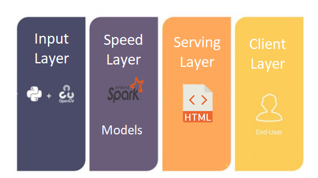

# Đồ án cuối kỳ Big Data

### Môn học 
- Công nghệ Dữ liệu lớn - IE212.M11
- GV: Đỗ Trọng Hợp

### Nhóm sinh viên thực hiện
  |       **Họ và tên**      |       **MSSV**       |
  |     :------------:       |    :-------------:   |
  |     Nguyễn Ngọc Quí      |     18520410         |
  |     Trang Hoàng Nhựt     |     18520123         |
  |     Nguyễn Thị Phương    |     18520135         |
  |     Lê Thị Minh Hiền     |     18520049         |

### Mô tả
- Kiến trúc xử lý luồng hình ảnh có thể mở rộng bằng cách sử dụng thư viện OpenCV, Tensorflow và Spark - Streaming. 
- Ứng dụng được chia làm 4 Layer. bao gồm: Input Layer, Speed Layer, Serving Layer và Client Layer.




### Cài đặt
Để tiến hành quá trình xử lý, bạn phải cài đặt một số gói phụ thuộc như sau:
 - Python
 - Tensorflow
 - OpenCV


Bạn có thể cài đặt các gói phụ thuộc bằng cầu lệnh sau:

```bash
pip install -r requirements.txt 
```

- Các model sử dụng tại: [link Drive](https://drive.google.com/drive/folders/1IZ2YgHekgiXqRzD3Akb5G-98j5XFYODB?usp=sharing)


- Cấu trúc cây thư mục chứa model

.

├── ...

├── model                 

│   ├── face-mask-detector          

|   |   ├── deploy.prototxt

|   |   ├── masknet_vgg19.h5

|   |   └── res10_300x300_ssd_iter_140000.caffemodel

│   └── object-detector   

|       ├── coco.names

|       ├── yolov3.cfg

|       └── yolov3.weights       

└── ...